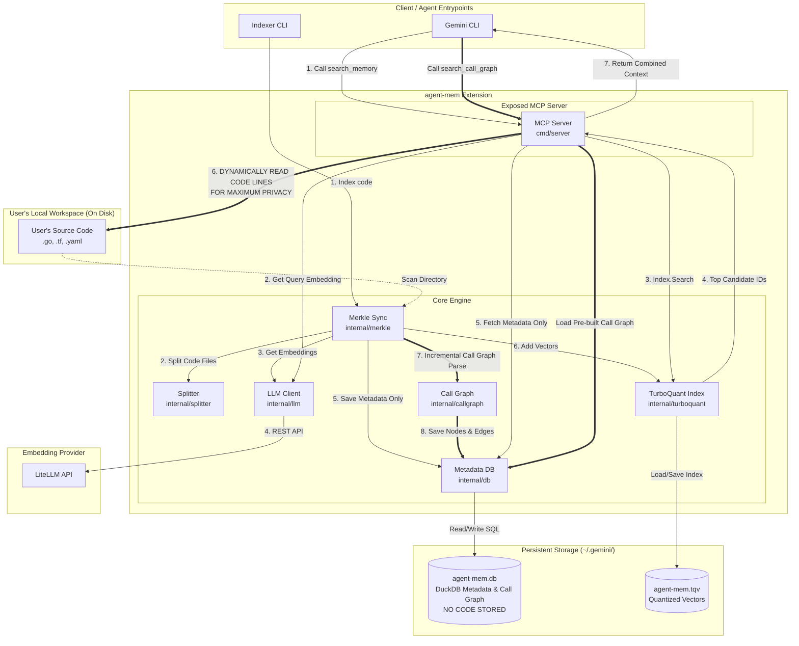

# Gemini Codebase Indexer With Persist Memory Extension

A model-agnostic Gemini CLI extension and MCP server in **Go** providing local codebase indexing and semantic search. It uses **DuckDB** for metadata and a quantized **TurboQuant** vector index for 12x-compressed, 3000x-accelerated similarity search.

---

## ✨ Key Features

*   **Merkle Tree Incremental Sync:** Computes directory tree diffs to index/re-embed only added or modified files (supporting `.go`, `.tf`, and `.yaml`/`.yml`).
*   **Privacy-Preserving Vector Storage:** No code is stored in the database. Only metadata headers are saved; raw code is read directly from local disk on demand during search.
*   **AST Call & Dependency Graph:** Extracts call nodes and edges incrementally into DuckDB, allowing fast traversal and ASCII call-tree generation.

> ⚠️ **Note:** Currently, the codebase indexer and call graph builder support indexing `.go`, `.tf`, and `.yaml` / `.yml` files.

---

## 🛠 Exposed MCP Tools

1.  **`search_memory`**: Semantic search across indexed workspace code blocks.
2.  **`search_call_graph`**: Explores bidirectional call chains (caller/callee)

---

## 🚀 Quick Start

### 1. Build and Install
```bash
make install
```

### 2. Index a Codebase
```bash
make index DIR=/path/to/your/codebase
```

### 3. Run Tests
```bash
make test         # Run unit tests
make test-all     # Run all tests & database self-checks
```

---

## ⚙ Configuration

Configure via environment variables:
*   `LITELLM_BASE_URL`: API base URL (Default: `http://localhost:36253/v1`)
*   `LITELLM_EMBEDDING_MODEL`: Embedding model (Default: `gemini-embedding-001`)
*   `LITELLM_CHAT_MODEL`: Chat model (Default: `gpt-5`)

---

## 📐 System Architecture



---

## 📊 TurboQuant Vector Compression Benchmark

```
================================================================================
        📊  TURBOQUANT VECTOR COMPRESSION BENCHMARK SUITE  📊                 
================================================================================

   📁 Targets: Aggregated Index (across 5 codebases)
   • Scanned Files: 5100 | Total Semantic Chunks: 16961 | Dimensions: 1536
   ------------------------------------------------------------------------------
   │ Data Footprint Type            │ Footprint Size │ Comp. Ratio │ Savings    │
   ├────────────────────────────────┼────────────────┼─────────────┼────────────┤
   │ [1] Standard Float32[] RAM     │  101766.00 KB  │      1.0x   │     0.0%   │
   │ [2] TurboQuant In-Memory Map   │   12998.86 KB  │      7.8x   │    87.2%   │
   │ [3] TurboQuant On-Disk .tqv    │   13383.31 KB  │      7.6x   │    86.8%   │
   └────────────────────────────────┴────────────────┴─────────────┴────────────┘

   📈 Visual Storage Footprint Comparison (Bar Scale):

   Standard Float32[] RAM   : [████████████████████████████████████████] (101766.0 KB)
   TurboQuant In-Memory Map : [█████░░░░░░░░░░░░░░░░░░░░░░░░░░░░░░░░░░░] (12998.9 KB) — 12x savings!
   TurboQuant On-Disk .tqv  : [█████░░░░░░░░░░░░░░░░░░░░░░░░░░░░░░░░░░░] (13383.3 KB) — Compact file!

================================================================================
```
