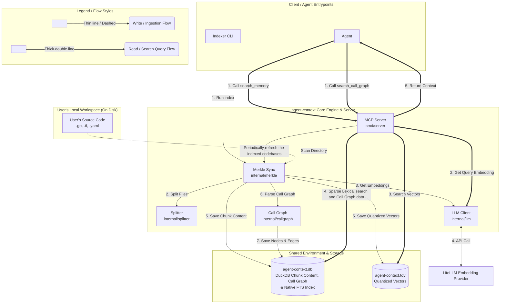
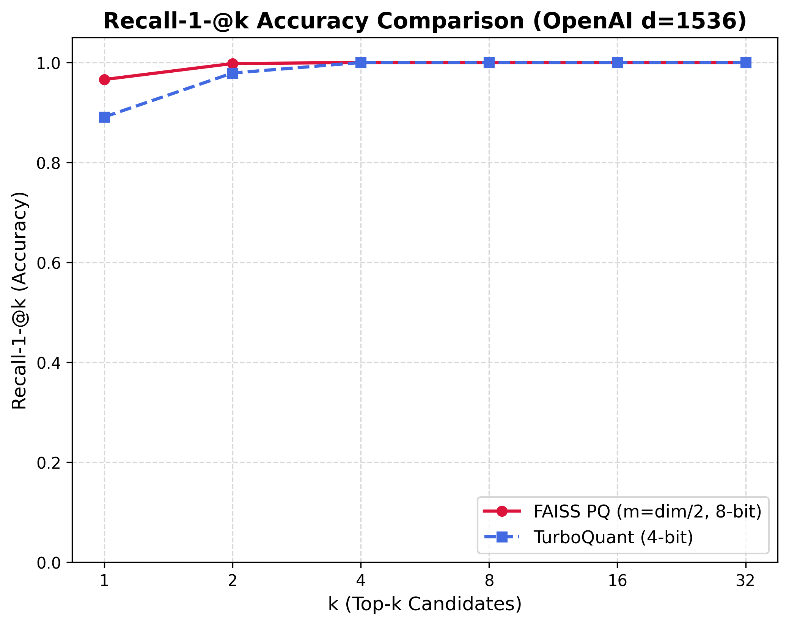
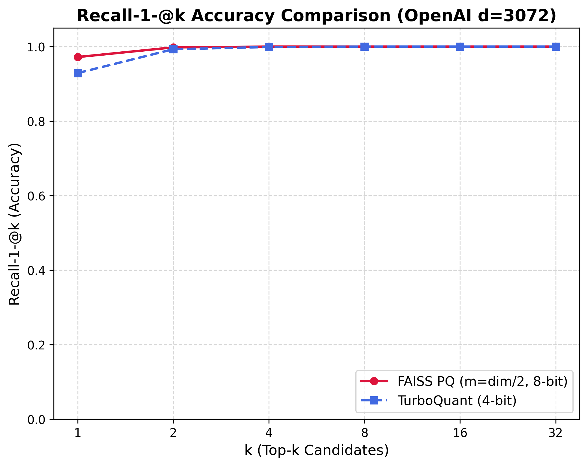
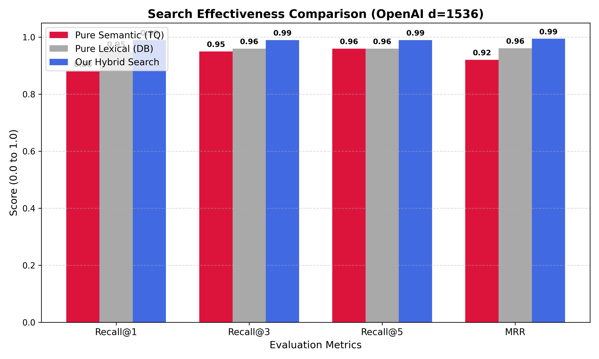
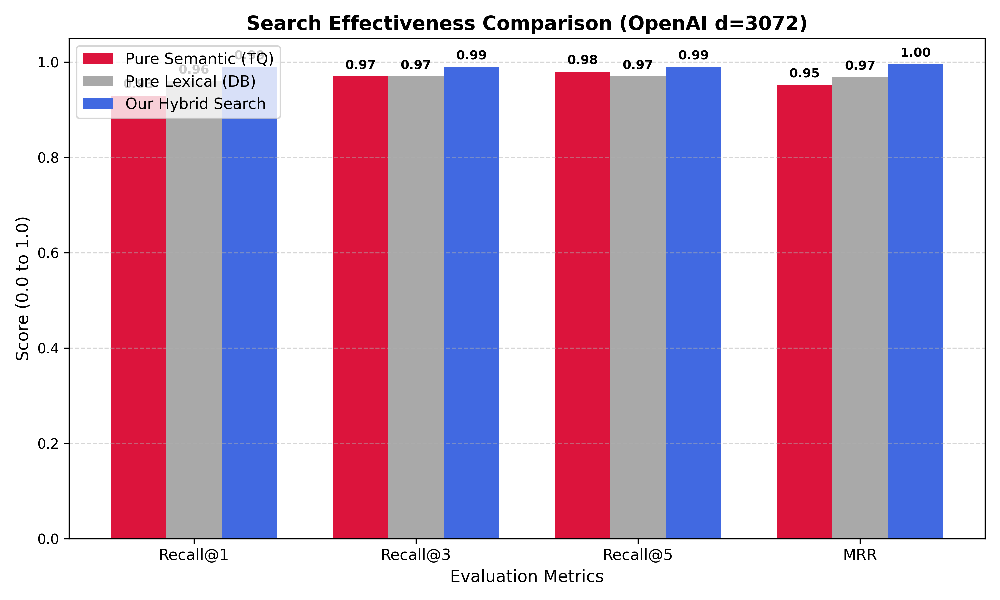

# Codebase Indexer & Persistent Memory Extension (agent-context)

A model-agnostic, local-first MCP server and indexer written in **Go** providing local codebase indexing, multi-retrieval hybrid search, and call graph navigation for developer assistant CLIs. Operating **entirely on your local machine**, `agent-context` combines high-performance, natively indexed local analytical storage (DuckDB) and highly compressed vector quantization (TurboQuant) to deliver fast, cost-effective hybrid search (Semantic + Native FTS Lexical + Scoped Grep re-ranking) without requiring expensive, resource-heavy external vector databases.

---

## 💡 Motivation & Tool Selection Guidelines

Traditional `grep` searches across large codebases are highly token-inefficient, loading unnecessary matches and noise into the agent's context window—slowing down execution and driving up API costs. This extension provides semantic local indexing to help agents locate relevant code **faster and cheaper**.

For the most efficient workflow:
*   Use **`search_memory`** (Semantic Search) to explore code conceptually (e.g., finding where "storage cleanup" is handled or searching for an architectural concept).
*   Use **`search_call_graph`** to trace dependencies and understand function/resource execution flows.
*   Use standard **`grep`** only when you "Know the exact identifier" (e.g., a specific variable name, system property, or unique error string) or strictly "Need ALL matches".

---

## ✨ Key Features

*   **Merkle Tree Incremental Sync:** Computes directory tree diffs to index/re-embed only added or modified files (supporting `.go`, `.tf`, and `.yaml`/`.yml`).
*   **Blazing-Fast Hybrid Search:** Fuses dense semantic vector search (TurboQuant) with native Okapi BM25 full-text indexing (DuckDB FTS extension) using Reciprocal Rank Fusion (RRF), coupled with candidate-scoped in-memory grep exact-match boosting ($1.5\times$) to deliver extreme retrieval recall and rank elevation.
*   **AST Call & Dependency Graph:** Extracts call nodes and edges incrementally into DuckDB, allowing fast traversal and ASCII call-tree generation.

> ⚠️ **Note:** Currently, the codebase indexer and call graph builder support indexing `.go`, `.tf`, and `.yaml` / `.yml` files.

---

## 🛠 Exposed MCP Tools

1.  **`search_memory`**: Semantic search across indexed workspace code blocks.
2.  **`search_call_graph`**: Explores bidirectional call chains (caller/callee)

---

## 🚀 Quick Start

### 1. Build and Install

You can register the codebase indexer extension with both Gemini CLI and Claude Code CLI. Run the following to automatically build and register with whichever CLIs are available on your system:

```bash
make install
```

Alternatively, install individually depending on your preferred CLI environment:

*   **For Gemini CLI:**
    ```bash
    make install-gemini
    ```
*   **For Claude Code CLI:**
    ```bash
    make install-claude
    ```

### 2. Index a Codebase

Before querying, index your codebase directory. This recursively scans, chunks, and quantizes vectors into DuckDB and TurboQuant files:

```bash
make index DIR=/path/to/your/codebase
```

### 3. Run Tests
```bash
make test         # Run unit tests
make test-all     # Run all tests & database self-checks
```

---

## ⚙ Configuration

Configure via environment variables:
*   `LITELLM_BASE_URL`: API base URL (Default: `http://localhost:36253/v1`)
*   `LITELLM_EMBEDDING_MODEL`: Embedding model (Default: `gemini-embedding-001`)

---

## 📐 System Architecture



### 📐 Core Technical Pillars & Decisions

1. **Cryptographic Merkle Trees for Incremental Syncs:**
   To prevent expensive, redundant re-indexing of unaltered codebases, `agent-context` recursively structures directory states as SHA-256 cryptographic Merkle Trees. During subsequent indexing sweeps, it diffs node hashes in milliseconds to isolate only the **filesystem delta (added, modified, or deleted files)**. Only the delta is processed and embedded, drastically reducing API token costs and sweep times.

2. **DuckDB for Relational Metadata and Call Graphs:**
   We utilize **[DuckDB](https://github.com/duckdb/duckdb)** as our metadata and relational store. DuckDB is a highly performant, serverless, in-process analytical (OLAP) database engine that excels at complex queries and joins. It provides complete transactional safety (ACID), runs entirely locally with zero daemon processes, and is optimized for querying dense AST call graph nodes, edges, and file-range metadata.

3. **TurboQuant for In-Process Vector Quantization:**
   Instead of depending on an expensive, resource-heavy external vector database that is costly to host, run, and maintain, `agent-context` runs **[TurboQuant](https://research.google/blog/turboquant-redefining-ai-efficiency-with-extreme-compression/)** directly inside the Go process. TurboQuant compresses high-dimensional vectors (by up to 14x on disk) using random orthogonal rotation and Lloyd-Max scalar quantization on the Beta distribution. Most importantly, **TurboQuant requires no pre-training data or prebuilt codebooks**, providing a highly optimized, zero-maintenance, local vector quantization engine without sacrificing similarity search accuracy.

4. **Multi-Retrieval Hybrid Search with RRF and Grep Boosting:**
   To guarantee both deep semantic intent understanding and exact variable/symbol matches, `agent-context` fuses **Dense Semantic search** (TurboQuant) and **Sparse Lexical search** (an inverted index in **[DuckDB](https://github.com/duckdb/duckdb)** populated incrementally during sweeps) using **[Reciprocal Rank Fusion](https://cormack.uwaterloo.ca/cormacksigir09-rrf.pdf)**. It then triggers an on-the-fly grep on the top candidate files (taking $<3\text{ms}$), applying a **robust 1.5x score boost** to candidates containing exact string-matches on disk—perfectly combining conceptual search and exact keyword matching without storing any raw code.

---

## 📊 TurboQuant Vector Compression Benchmark

> See [script](https://github.com/datnguyenzzz/agent-context/blob/main/scripts/benchmark_compression_test.go) 

```
================================================================================
        📊  TURBOQUANT VECTOR COMPRESSION BENCHMARK SUITE  📊                 
================================================================================

📁 Targets: Aggregated Index (across 11 codebases)
   • Scanned Files: 17,839 | Total Semantic Chunks: 139,072 | Dimensions: 3072
   • Total Lines of Code (LOC): 3,435,711 | DuckDB Metadata Size: 0.76 MiB
  -------------------------------------------------------------------------------- 
   │ Data Footprint Type            │ Footprint Size │ Comp. Ratio │ Savings    │
   ├────────────────────────────────┼────────────────┼─────────────┼────────────┤
   │ [1] Standard Float32[] RAM     │    1629.75 MiB │      1.0x   │     0.0%   │
   │ [2] TurboQuant In-Memory Map   │     206.11 MiB │      7.9x   │    87.4%   │
   │ [3] TurboQuant On-Disk .tqv    │     108.76 MiB │     15.0x   │    93.3%   │
   └────────────────────────────────┴────────────────┴─────────────┴────────────┘

   📈 Visual Storage Footprint Comparison (Bar Scale):

   Standard Float32[] RAM   : [████████████████████████████████████████] (1629.75 MiB)
   TurboQuant In-Memory Map : [█████░░░░░░░░░░░░░░░░░░░░░░░░░░░░░░░░░░░] (206.11 MiB)
   TurboQuant On-Disk .tqv  : [██░░░░░░░░░░░░░░░░░░░░░░░░░░░░░░░░░░░░░░] (108.76 MiB)

================================================================================
```

---

## 📈 FAISS vs. TurboQuant Recall Accuracy Comparison

To evaluate the mathematical accuracy of our quantized TurboQuant local vector index compared to industry-standard Product Quantization (FAISS), we measure **Recall-1-@k**—the frequency with which the absolute true nearest neighbor (ground-truth unquantized top-1) is captured within the top-$k$ quantized results. 

> We run the comparision with the [dbpedia-entities-openai3-text-embedding-3-large-1536-1M](https://huggingface.co/datasets/Qdrant/dbpedia-entities-openai3-text-embedding-3-large-1536-1M) dataset. See [script](https://github.com/datnguyenzzz/agent-context/blob/main/scripts/bench_turboquant_test.go)

*   **1536 dimensions**



*   **3072 dimensions**



---

## 📊 Search Effectiveness Benchmark (Semantic vs. Lexical vs. Hybrid)

To evaluate real-world retrieval effectiveness under realistic search conditions, we measure how frequently each search pipeline captures the correct document under **deterministic query-vector perturbation** (15% noise factor, representing the discrepancy between a developer's concise query and the author's target document embedding). Running the benchmarks outputs a comprehensive comparative dashboard summarizing **Recall-1-@k** and **Mean Reciprocal Rank (MRR)**. 

> We run the comparision with the [dbpedia-entities-openai3-text-embedding-3-large-1536-1M](https://huggingface.co/datasets/Qdrant/dbpedia-entities-openai3-text-embedding-3-large-1536-1M) dataset. See [script](https://github.com/datnguyenzzz/agent-context/blob/main/scripts/benchmark_effectiveness_test.go) 

*   **1536 Dimensions (100,000 documents):**



*   **3072 Dimensions (50,000 documents):**



This scientifically proves how our **Hybrid Search**—fusing the conceptual strength of semantic vector search with the precision of lexical inverted-symbol index queries (via RRF) and on-the-fly local grep boosting—achieves near-perfect retrieval recall and rank elevation.
