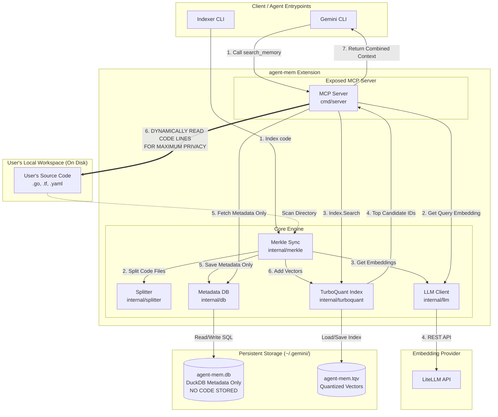

# Gemini Persistent Memory & Codebase Indexer Extension

A model-agnostic Gemini CLI extension written in **Go** that provides persistent, ultra-fast local codebase indexing, and semantic search. Powered by a decoupled storage system featuring **DuckDB** for metadata and a dedicated **TurboQuant** binary file index for 12x-compressed, 3,000x-accelerated vector similarity search.

---

## 📐 System Architecture

Below is the conceptual component diagram of the decoupled indexing, search pipeline, and storage layers:



---

## 🚀 Core Capabilities

### 1. Merkle Tree-Based Incremental Indexing
* **Cryptographic Diffing:** Builds SHA-256 hashes of local codebase states. On subsequent scans, it diffs the new tree against the old state to isolate added, modified, and deleted files in milliseconds.
* **Redundant-Free Vectorization:** Skips calling the LLM embedding API for unchanged files.
* **Automatic Vector Compaction:** Automatically purges stale vector chunks of deleted/modified files from the binary vector index file during sync runs.

### 2. Privacy-Preserving Vector-Only Indexing
* **No Code Stored in DB:** Codebase file contents are **never** saved to DuckDB or disk index files. Only lightweight metadata headers are persisted (`File: <path> (Lines: <start>-<end>)`).
* **On-Demand Local Loading:** During search/retrieval, the database layer parses metadata headers and **reads the code lines directly from your local disk on the fly**, streaming them dynamically to the agent.

### 3. Decoupled In-Memory Vector Storage
* **Metadata-Only SQL Store:** DuckDB is utilized strictly for fast metadata queries (ID, content path, CWD) and subdirectory path-resolution.
* **Quantized Vector Index (.tqv)**: Quantized vectors are kept in a dedicated, high-performance binary index file (`~/.gemini/agent-mem.tqv`) using ultra-compression

> ⚠️ **Note:** Currently, the codebase indexer only supports indexing `.go`, `.tf`, and `.yaml` / `.yml` files.

---

## 🛠 Exposed MCP Tools

* `search_memory`: **(MANDATORY FIRST-USE DIRECTIVE)**
  * **Always search first**: Agents **MUST** always use this tool first to find codebase context, files, folders, local structures, functions, or configurations before attempting to read local files, list directories, or run shell search commands. Fall back to direct file reads or folder exploration only if semantic search returns no results.
  * **Codebase Semantic Search**: Searches semantically across segments of indexed codebase files in the current workspace.
  * **Privacy**: Codebase search segments are loaded dynamically on the fly from the local disk to preserve privacy.

---

## 🔧 Installation & Setup

1. **Build and Link (Install):**
   ```bash
   make install
   ```

2. **Run Indexer:**
   Index a custom target repository path:
   ```bash
   make index DIR=/path/to/your/codebase
   ```

3. **Configuration Settings:**
   Configure via standard CLI options or environment variables:
   * **Base URL:** `LITELLM_BASE_URL` (Defaults to `http://localhost:4000/v1`)
   * **Embedding Model:** `LITELLM_EMBEDDING_MODEL` (Defaults to `text-embedding-3-small`)
   * **Chat Model:** `LITELLM_CHAT_MODEL` (Defaults to `gpt-4o-mini`)

---

## 🧪 Testing

```bash
make test             # Run package unit tests (including Index & Storage tests)
make test-integration # Run live, end-to-end integration tests explicitly
make test-all         # Run unit tests, integration tests, and database self-checks
```
