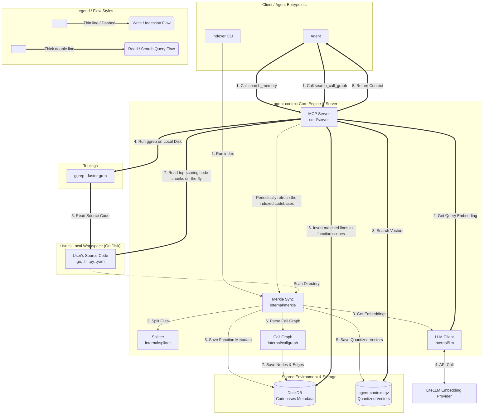

## agent-context

A model-agnostic, local-first MCP server and indexer in **Go** that helps AI coding assistants search and navigate your codebase without wasting context tokens. By employing a **zero-storage, privacy-first design**, it never duplicates or replicates your source code inside a database. Instead, it indexes only lightweight symbol metadata, executing blazingly fast semantic and regex searches to stream exact, matching code functions **on-the-fly directly from your local disk**. This completely resolves the token-bloat and data privacy issues of raw file ingestion, delivering precise retrieval without requiring a heavy RAG system

---

## 💡 Motivation

In modern agentic harness workflows, `grep` is incredibly powerful—and often [is all you need](https://arxiv.org/pdf/2605.15184). However, raw `grep` alone is highly token-inefficient because it returns un-scoped matching lines and massive boilerplate noise, forcing the agent to ingest everything into its context window, driving up API costs. `agent-context` resolves this by introducing **Grep AI**. By running the grep command on your codebase and filtering the results on-the-fly using semantic meaning, we locate, extract, and load only the exact, containing AST functions. This delivers 100% precise retrieval with ~0 token waste

---

## ✨ Key Features

*   **Merkle Tree Incremental Sync:** Computes directory tree diffs to index/re-embed only added or modified files (supporting `.go`, `.tf`, and `.yaml`/`.yml`).
*   **Blazing-Fast Hybrid Search:** Fuses dense semantic vector search (TurboQuant) with native Okapi BM25 full-text indexing (DuckDB FTS extension) using Reciprocal Rank Fusion (RRF), coupled with candidate-scoped in-memory grep exact-match boosting ($1.5\times$) to deliver extreme retrieval recall and rank elevation.
*   **AST Call & Dependency Graph:** Extracts call nodes and edges incrementally into DuckDB, allowing fast traversal and ASCII call-tree generation.

> ⚠️ **Note:** Currently, the codebase indexer and call graph builder support indexing `.go`, `.tf`, `.py` and `.yaml` / `.yml` files.

---

## 🛠 Exposed MCP Tools

1.  **`search_memory`**: Semantic search across indexed workspace code blocks.
2.  **`search_call_graph`**: Explores bidirectional call chains (caller/callee)

---

## 🚀 Quick Start

### 1. Build and Install

You can register the codebase indexer extension with both Gemini CLI and Claude Code CLI. Run the following to automatically build and register with whichever CLIs are available on your system:

```bash
make install
```

Alternatively, install individually depending on your preferred CLI environment:

*   **For Gemini CLI:**
    ```bash
    make install-gemini
    ```
*   **For Claude Code CLI:**
    ```bash
    make install-claude
    ```

### 2. Index a Codebase

Before querying, index your codebase directory. This recursively scans, chunks, and quantizes vectors into DuckDB and TurboQuant files:

```bash
make index DIR=/path/to/your/codebase
```

### 3. Run Tests
```bash
make test         # Run unit tests
make test-all     # Run all tests & database self-checks
```

---

## ⚙ Configuration

Configure via environment variables:
*   `LITELLM_BASE_URL`: API base URL (Default: `http://localhost:36253/v1`)
*   `LITELLM_EMBEDDING_MODEL`: Embedding model (Default: `gemini-embedding-001`)

---

## 📐 System Architecture



### 📐 Core Technical Pillars & Decisions

1. **Cryptographic Merkle Trees for Incremental Syncs:**
   To prevent expensive, redundant re-indexing of unaltered codebases, `agent-context` recursively structures directory states as SHA-256 cryptographic Merkle Trees. During subsequent indexing sweeps, it diffs node hashes in milliseconds to isolate only the **filesystem delta (added, modified, or deleted files)**. Only the delta is processed and embedded, drastically reducing API token costs and sweep times.

2. **DuckDB for Relational Metadata and Call Graphs:**
   We utilize **[DuckDB](https://github.com/duckdb/duckdb)** as our metadata and relational store. DuckDB is a highly performant, serverless, in-process analytical (OLAP) database engine that excels at complex queries and joins. It provides complete transactional safety (ACID), runs entirely locally with zero daemon processes, and is optimized for querying dense AST call graph nodes, edges, and function scopes (`function_name`, `cwd`, `line_start`, `line_end`) with **zero raw source code stored in-database**, saving over 99% database storage space!

3. **TurboQuant for In-Process Vector Quantization:**
   Instead of depending on an expensive, resource-heavy external vector database that is costly to host, run, and maintain, `agent-context` runs **[TurboQuant](https://research.google/blog/turboquant-redefining-ai-efficiency-with-extreme-compression/)** directly inside the Go process. TurboQuant compresses high-dimensional vectors (by up to 14x on disk) using random orthogonal rotation and Lloyd-Max scalar quantization on the Beta distribution. Most importantly, **TurboQuant requires no pre-training data or prebuilt codebooks**, providing a highly optimized, zero-maintenance, local vector quantization engine without sacrificing similarity search accuracy.

4. **Zero-Storage Metadata-Guided Hybrid Search with RRF & ggrep:**
   To guarantee absolute retrieval accuracy without code footprint replication, `agent-context` fuses **Dense Semantic search** (TurboQuant) and **Sparse Lexical search** using **[Reciprocal Rank Fusion](https://cormack.uwaterloo.ca/cormacksigir09-rrf.pdf)**. 
   Our custom, ultra-fast `ggrep` library is linked natively within the server process, running high-speed multi-threaded Regex scans directly on the local codebase. When lines match, the engine performs an **inverted query in DuckDB** to map matched lines to their containing logical AST functions on-the-fly (`line_start <= matched_line <= line_end`). Raw code contents of top-scoring candidates are streamed from the local filesystem on-the-fly, achieving sub-millisecond search latencies and a pure zero-copy storage footprint!

---

## 📊 TurboQuant Vector Compression Benchmark

> See [script](https://github.com/datnguyenzzz/agent-context/blob/main/scripts/benchmark_compression_test.go) 

```
================================================================================
        📊  TURBOQUANT VECTOR COMPRESSION BENCHMARK SUITE  📊                 
================================================================================

📁 Targets: Aggregated Index (across 11 codebases)
   • Scanned Files: 17,839 | Total Semantic Chunks: 139,072 | Dimensions: 3072
   • Total Lines of Code (LOC): 3,435,711 | DuckDB Metadata Size: 0.76 MiB
  -------------------------------------------------------------------------------- 
   │ Data Footprint Type            │ Footprint Size │ Comp. Ratio │ Savings    │
   ├────────────────────────────────┼────────────────┼─────────────┼────────────┤
   │ [1] Standard Float32[] RAM     │    1629.75 MiB │      1.0x   │     0.0%   │
   │ [2] TurboQuant In-Memory Map   │     206.11 MiB │      7.9x   │    87.4%   │
   │ [3] TurboQuant On-Disk .tqv    │     108.76 MiB │     15.0x   │    93.3%   │
   └────────────────────────────────┴────────────────┴─────────────┴────────────┘

   📈 Visual Storage Footprint Comparison (Bar Scale):

   Standard Float32[] RAM   : [████████████████████████████████████████] (1629.75 MiB)
   TurboQuant In-Memory Map : [█████░░░░░░░░░░░░░░░░░░░░░░░░░░░░░░░░░░░] (206.11 MiB)
   TurboQuant On-Disk .tqv  : [██░░░░░░░░░░░░░░░░░░░░░░░░░░░░░░░░░░░░░░] (108.76 MiB)

================================================================================
```

---

## 📈 FAISS vs. TurboQuant Recall Accuracy Comparison

To evaluate the mathematical accuracy of our quantized TurboQuant local vector index compared to industry-standard Product Quantization (FAISS), we measure **Recall-1-@k**—the frequency with which the absolute true nearest neighbor (ground-truth unquantized top-1) is captured within the top-$k$ quantized results. 

> We run the comparision with the [dbpedia-entities-openai3-text-embedding-3-large-1536-1M](https://huggingface.co/datasets/Qdrant/dbpedia-entities-openai3-text-embedding-3-large-1536-1M) dataset. See [script](https://github.com/datnguyenzzz/agent-context/blob/main/scripts/bench_turboquant_test.go)

*   **1536 dimensions**


*   **3072 dimensions**


---

## 📊 Search Effectiveness Benchmark (Semantic vs. Lexical vs. Hybrid)

To evaluate real-world retrieval effectiveness under realistic search conditions, we measure how frequently each search pipeline captures the correct document under **deterministic query-vector perturbation** (15% noise factor, representing the discrepancy between a developer's concise query and the author's target document embedding). Running the benchmarks outputs a comprehensive comparative dashboard summarizing **Recall-1-@k** and **Mean Reciprocal Rank (MRR)**. 

> We run the comparision with the [dbpedia-entities-openai3-text-embedding-3-large-1536-1M](https://huggingface.co/datasets/Qdrant/dbpedia-entities-openai3-text-embedding-3-large-1536-1M) dataset. See [script](https://github.com/datnguyenzzz/agent-context/blob/main/scripts/benchmark_effectiveness_test.go) 

*   **1536 Dimensions (100,000 documents):**


*   **3072 Dimensions (50,000 documents):**


This scientifically proves how our **Hybrid Search**—fusing the conceptual strength of semantic vector search with the precision of lexical inverted-symbol index queries (via RRF) and on-the-fly local grep boosting—achieves near-perfect retrieval recall and rank elevation.
